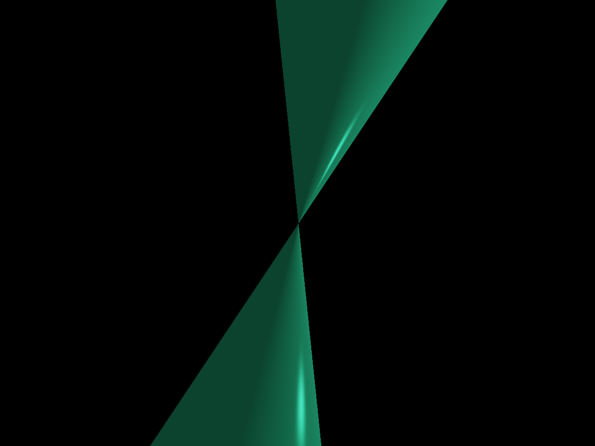
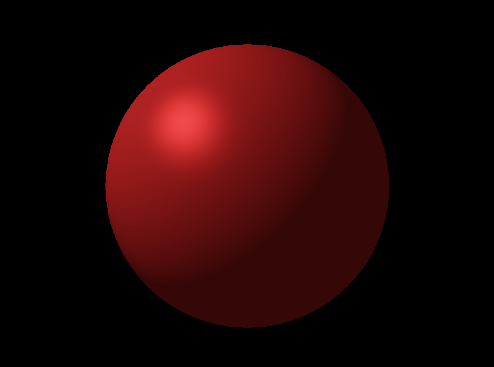
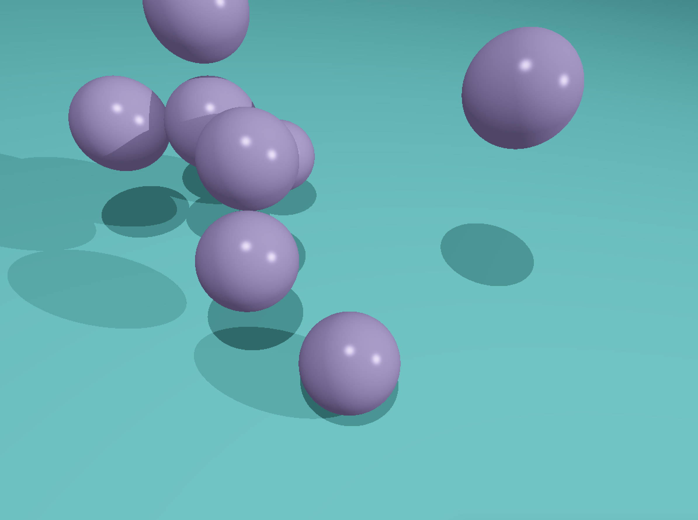
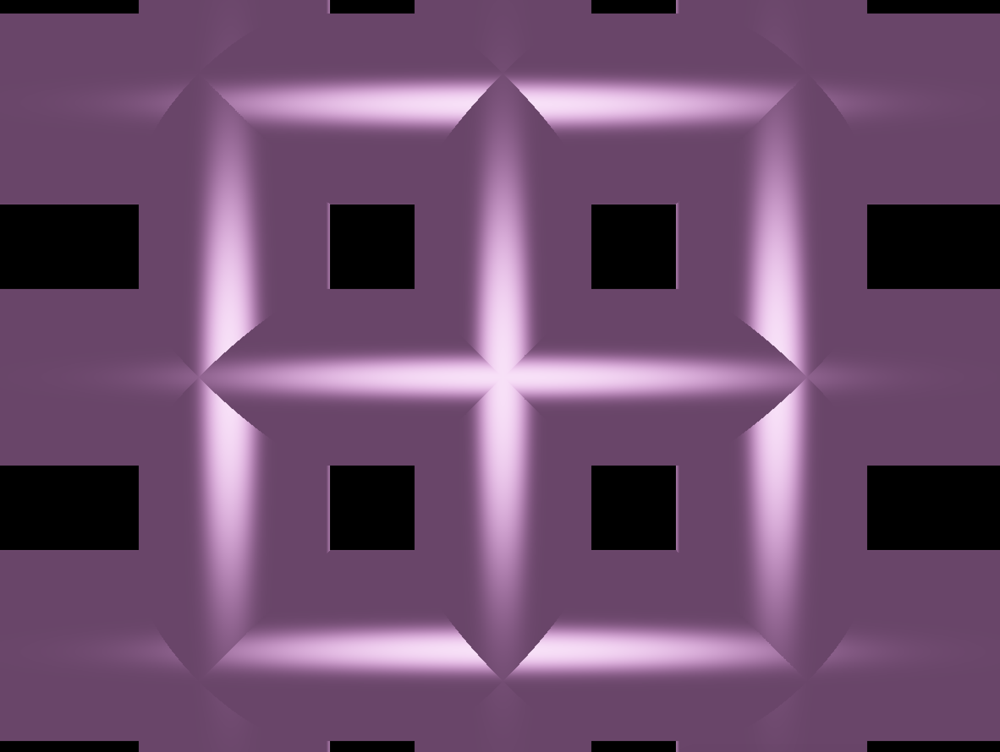

# RTv1

This mini-project is the first step to create a Raytracing program

**Cone, one light**



**Sphere, one light**



**One plane, eight spheres, two lights**



**Six cylinders, two lights**



---

## Scenes

- Scenes are made in JSON style, so you can add, delete and manipulate(rotate) objects and lights through that file.

## Installation

- You have to download Minilibx library to run RTv1 on your Mac.

### Clone

- Clone this repo to your local machine using `https://github.com/natqegu/rtv1.git`

### Setup

> run the project using Makefile feature

```shell
$ make
```

> now you can run executable file 'RTv1' with one of the scenes from scenes folder

```shell
$ ./RTv1 scenes/scene5
```

> you can clean a workspace of object files, created during compilation

```shell
$ make clean
```

> and also delete every file created during compilation

```shell
$ make fclean
```

---

## FAQ

- **Can I run the project on Windows?**
    - No!